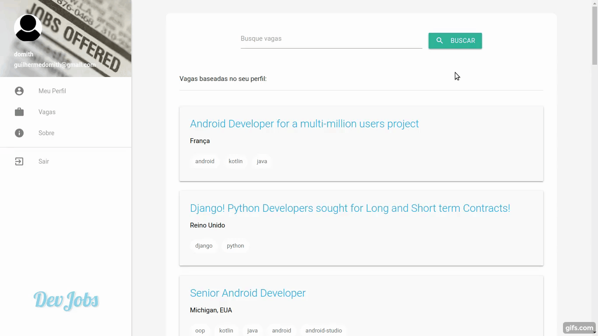
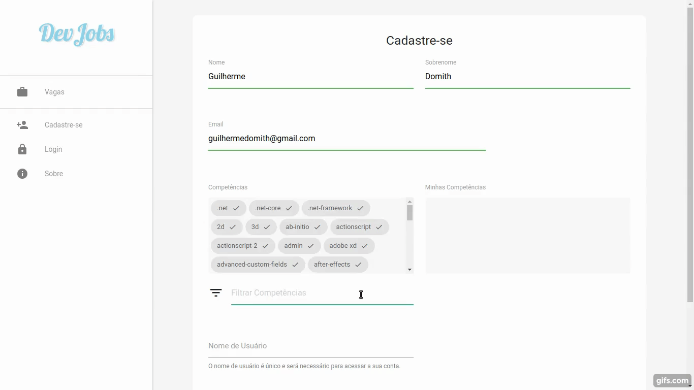

  

## Trabalho Final do Curso de Mineração de Dados Aplicada

Esta aplicação foi desenvolvida como solução para o trabalho final do [curso de mineração de dados aplicada](http://github.com/rafjaa/curso-mineracao-de-dados-aplicada), realizado no *Instituto Federal do Sudeste de Minas Gerais - Campus Barbacena*. 

A aplicação criada facilita para os usuários desenvolvedores a forma de encontrar vagas de emprego e receber sugestões para aprimorar seus conhecimentos. Com este objetivo, utiliza-se técnicas de mineração de dados na coleta dos dados, no pre-processamento dos mesmos e em três pontos da aplicação: 

> A metrica *similaridade de cosseno* é utilizada entre a busca do usuário e as vagas disponíveis, permitindo que a busca seja ranqueada pelos resultados que têm mais proximidade com o que foi buscado;

> Para facilitar o cadastro de competências do usuário, utiliza-se a *similaridade* para prever o que o usuário está digitando, e então utiliza-se a *correlação* entre esta competência prevista e as outras existentes, para assim, sugerir competências que possivelmente o usuário também tenha.

> Para a sugerir cursos relacionados à uma vaga selecionada também utiliza-se a *similaridade* entre as competências exigidas da vaga e a descrição dos cursos disponíveis.

